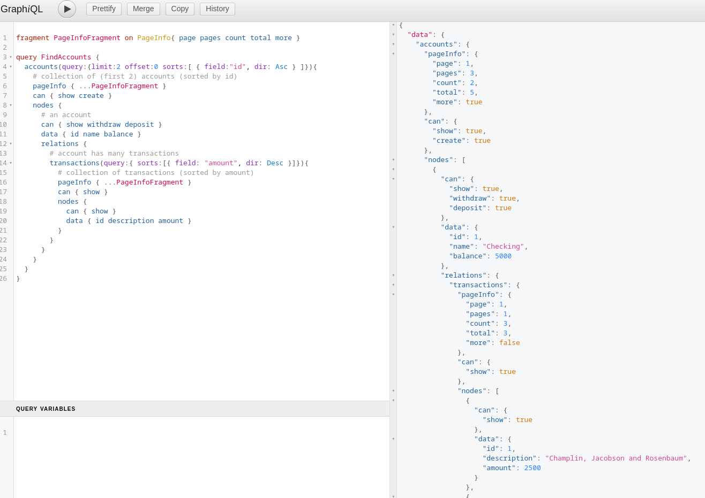
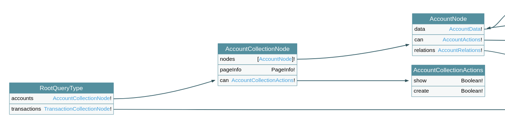
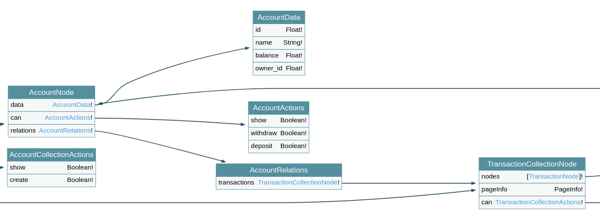

# [Writing a GraphQL TypeScript Server in NodeJS](https://examples-accounts.nickkelly.dev)


GraphQL is becoming an increasingly viable alternative to REST in modern web development by providing significant productivity and performance advantages.

In this post we will explore some important parts of writing a NodeJS code-first vanilla GraphQL Server in TypeScript.

## This is for

People who understand the basics of GraphQL and want to see some patterns, techniques and different non-decorator approaches to buidling a GraphQL server in TypeScript.

## This is not

A complete front-to-back tutorial.

You will see important code snippets and fill in the blanks with the rest of your stack.

## Final result:

For the complete example server code, visit the [GitHub](https://github.com/NickKelly1/example-gql-ts-accounts).

- [Live server](https://example-accounts.nickkelly.dev)
- [Live schema](https://example-accounts.nickkelly.dev/visualise)
- [Docker](https://hub.docker.com/repository/docker/nick3141/example-gql-ts-accounts)
- [GitHub](https://github.com/NickKelly1/example-gql-ts-accounts)


### [GraphiQL](https://example-accounts.nickkelly.dev)



### [Partial Schema](https://example-accounts.nickkelly.dev/visualise)




### Supported queries

A GraphQL server built with the architecture outlined be low will support queries and mutations such as:

```GraphQL
fragment PageInfoFragment on PageInfo{ page pages count total more }

# Find many Accounts
query FindAccounts {
  accounts(query:{limit:2 offset:0 sorts:[ { field:"id", dir: Asc } ]}){
    # collection of (first 2) accounts (sorted by id)
    pageInfo { ...PageInfoFragment }
    can { show create }
    nodes {
      # an account
      can { show withdraw deposit }
      data { id name balance }
      relations {
        # account has many transactions
        transactions(query:{ sorts:[{ field: "amount", dir: Desc }]}){
          # collection of transactions (sorted by amount)
          pageInfo { ...PageInfoFragment }
          can { show }
          nodes {
            can { show }
            data { id description amount }
          }
        }
      }
    }
  }
}

# Deposit into an Account
mutation Deposit {
  deposit(dto:{ account_id:1 amount:999999 }) {
    data { id name balance }
    relations{
      transactions(query: { sorts: [{ field: "id", dir: Desc }] }) {
        nodes{
          data{ id, description, amount }
        }
      }
    }
  }
}

# Withdraw from an Account
mutation Withdraw {
  deposit(dto:{ account_id:1 amount:20 }) {
    data { id name balance }
    relations{
      transactions(query: { sorts: [{ field: "id", dir: Desc }] }) {
        nodes{
          data{ id, description, amount }
        }
      }
    }
  }
}
```

## Background

### Code-first: decorators vs objects

Most popular guides use experimental / to-be-deprecated [TypeScript (ES6) Decorators](https://www.typescriptlang.org/docs/handbook/decorators.html) which obscure the GraphQL resolution process by merging the ORM layer with the API and the API layer with the authorisation layer.

Instead of Decorators, we will use the primitives provided by the [graphql npm package](https://www.npmjs.com/package/graphql). Most importantly: `GraphQLObjectType` and `GraphQLInputType`. These primitives are powerful enough to build a highly expressive and flexible GraphQL API.


### GraphQL as the Engine of Application State

HATEOAS (Hypertext as the Engine of Application State) is an important part of the rest standard.

In practice, HATEOAS means the server should publish client-resource authorisation and routing to minimise code duplication on the client. A resource response should contain [authorisation and link metadata](https://en.wikipedia.org/wiki/HATEOAS#:~:text=Hypermedia%20as%20the%20Engine%20of,provide%20information%20dynamically%20through%20hypermedia.).

```http
HTTP/1.1 200 OK
Content-Type: application/vnd.acme.account+json
Content-Length: ...

{
    "account": {
        "account_number": 12345,
        "balance": {
            "currency": "usd",
            "value": 100.00
        },
        "links": {
            "deposit": "/accounts/12345/deposit",
            "withdraw": "/accounts/12345/withdraw",
            "transfer": "/accounts/12345/transfer",
            "close": "/accounts/12345/close"
        }
    }
}
```

GraphQL makes this a easier than REST since GraphQL API's often served off a single URL removing the need for "links". Furthermore, GraphQL's introspective type system lets developers circumvent API docs.

### Leveraging Query Resolution to Create Flexible Graphs

Understanding how GraphQL resolves a queries by separating `Type` and `Source` lets us build flexible and well separated JSON structures.

A GraphQL server resolves a query by traversing the `GraphQLObjectType` tree to build a JSON response. However, the `Source` returned from a resolver need not of similar shape as the resolving `GraphQLObjectType`.

For example, a `GraphQLObjectType` that resolves an `Account` would typically resolve all fields, relations, and metadata on the same `GraphQLObjectType` node. Although, having separated our ORM layer from our GraphQL layer (something a Decorator based approach would obscure), we can separate an `Account` into multiple `GraphQLObjectTypes` representing an `Accounts` different categories of data, such as `AccountData` (the fields on an `accounts` table in the database), `AccountActions` (G|HATEOAS / action authorisation for the `Account` resource), `AccountRelations` (or `AccountConnections`), and additional objects for any additional categories of data associated with an `Account`.

```GraphQL
# AccountNode fields:

  # type: AccountActions
  can { show withdraw deposit }

  # type: AccountData
  data { id name balance }

  # type: AccountRelations
  relations {

    # type: TransactionCollection
    transactions(query:{ sorts:[{ field: "amount", dir: Desc }]}){

      # type: PageInfo
      pageInfo { ...PageInfoFragment }

      # type: TransactionCollectionActions
      can { show }

      # type: GraphQLList(TransactionNode)
      nodes {

        # type: TransactionActions
        can { show }

        # type: TransactionData
        data { id description amount }

        # type: TransactionRelations
        relations { ... }
      }
    }
  }
```

This is in contrast to the flat equivalent:

```GraphQL
# AccountNode fields:

  # authorisation
  canShow

  # authorisation
  canWithdraw

  # authorisation
  canDeposit

  # data
  id

  # data
  name

  # data
  balance

  # relation / connection
  transactionRelation(query:{ sorts:[{ field: "amount", dir: Desc }]}){

    # pagination
    pageInfo { ...pageInfoFragment }

    # list
    nodes {

      # authorisation
      canShow

      # data
      id

      # data
      description

      # data
      amount

      # relation / connection
      accountRelation{ ... }
    }
  }
```

## Code

### Schema

As always with GraphQL, we provide a root Query type for reading and root Mutation type for updating.

Due to NodeJS module resolution and the cyclic nature of graph data structures, we run into [import races](https://nodejs.org/api/modules.html#modules_cycles) when node resolves our program. To get around this, the [graphql](https://www.npmjs.com/package/graphql) library lets us define fields as Thunks. Instead of defining a field object, we define a function that returns the field object. After all circular modules are resolved by node, the GraphQL server can resolve the fields and the schema.

```TypeScript
/**
 * @ root.gql.ts
 *
 * Root Queries & Mutations
 */

import { GraphQLObjectType }  from 'graphql';
import { GqlContext } from './common/gql.context.ts';
import { AccountQuery } from './account/account.gql.query.ts';
import { TransactionQuery } from './transaction/transaction.gql.query.ts';

const RootQuery = new GraphQLObjectType<unknown, GqlContext>({
  name: 'RootQueryType',
  // To keep things consistent and avoid circular dependency issues we write all our `fields` as thunks.
  fields: () => ({
    ...unthunk(AccountQuery),
    ...unthunk(TransactionQuery),
  }),
})

const RootMutation = new GraphQLObjectType<unknown, GqlContext>({
  name: 'RootMutationType',
  fields: () => ({
    ...unthunk(AccountMutation),
    ...unthunk(TransactionMutation),
  }),
})

// give this schema to the Gql server
export const schema = new GraphQLSchema({
  query: RootQuery,
  mutation: RootMutation,
});

function unthunk<T>(mbThunk: Thunk<T>): T {
  if (typeof mbThunk === 'function') return (mbThunk as () => T)();
  return mbThunk;
}

```

### AccountQuery

We define root level query fields for `Accounts`, which are provided to the `RootQuery` above.

This is what lets us write

```GraphQL
query {
  accounts{
    ...
  }
}
```

```TypeScript
/**
 * @ account/account.gql.query.ts
 *
 * Accounts Query
 *
 * For queries like FindManyAccounts and FindOneAccount
 */

import HttpErrors from 'http-errors';
import { GqlContext } from '../common/classes/gql.context.ts';
import { Thunk, GraphQLFieldConfigMap, GraphQLNonNull } from "graphql";


// root Query type for an account
// is an "Api Endpoint" for querying Accounts
// thunk with the query fields to reduce the change of nasty import races
export const AccountQuery: Thunk<GraphQLFieldConfigMap<unknown, GqlContext>> = () => ({
  /**
   * Find Accounts
   */
  accounts: {
    // tell Gql to resolve the returned object as an AccountCollectionNode
    type: GraphQLNonNull(AccountCollectionNode),

    // Query can have filtering, sorting, pagination (limit, offset), withSoftDeleted, etc...
    args: { query: { type: CollectionQueryInput, }, },

    // return an AccountNodeCollectionSource type, NOT an AccountNode type.
    // Gql will resolve it as an AccountNodeCollection type.
    resolve: async (parent, args, ctx): Promise<IAccountCollectionNodeSource> => {
      if (!ctx.services.accountPolicy.canFindMany()) {
        throw new HttpErrors.Forbidden('Cannot Find Accounts');
      }

      const options = parseQuery(args.query);

      const results  = await ctx
        .services
        .accountRepository
        .findAllAndCount(options);

      // remove models that the requester is unauthorised to view
      // (that should have been filtered out by repository)
      const findableModels: (null | AccountModel)[] = results.rows.map((model) => (
        ctx.services.accountPolicy.canFindOne({ model })
          ? model
          : null
      ));

      const pageInfo = getPageInfo(options, results);

      const collectionSource: IAccountCollectionNodeSource = {
        nodes: findableModels,
        pageInfo,
      };

      return collectionSource;
    },
  },
});
```

### AccountCollectionNode

An `AccountCollectionNode` represents a paginated list of `Accounts`.

It has an array of `AccountNodes`, a `AccountCollectionActions` object with actions the client is/isn't authorised to take on the collection, and a `PageInfo` object detailing the results page number, total pages, whether there are more pages, etc....

```TypeScript
/**
 * @ account/account.gql.collection.node.ts
 *
 * AccountCollectionNode
 *
 * GraphQLObjectType for a paginated collection of Accounts
 */

import { GraphQLObjectType, GraphQLNonNull, GraphQLList, GraphQLBoolean } from "graphql";
import { GqlContext } from "../common/classes/gql.context";
import { GqlNone, IGqlNoneSource } from "../common/gql/gql.none";
import { IPageInfoSource, PageInfo } from "../common/gql/gql.page-info";
import { AccountNode, IAccountNodeSource } from "./account.gql.node";
import { AccountModel } from "./account.model";

export interface IAccountCollectionNodeSource {
  nodes: (null | AccountModel)[];
  pageInfo: IPageInfoSource;
  // ...other collection metadata
}
export const AccountCollectionNode = new GraphQLObjectType<IAccountCollectionNodeSource, GqlContext>({
  name: 'AccountCollectionNode',
  fields: () => ({
    // resolve: list of AccountNode
    nodes: {
      type: GraphQLNonNull(GraphQLList(AccountNode)),
      // source as array of AccountModel's
      resolve: (parent): (null | IAccountNodeSource)[] => parent.nodes,
    },

    // resolve: PageInfo
    pageInfo: {
      type: GraphQLNonNull(PageInfo),
      resolve: (parent): IPageInfoSource => parent.pageInfo,
    },

    // resolve: AccountCollectionActions
    can: {
      resolve: (parent): IGqlNoneSource => GqlNone,
      type: GraphQLNonNull(new GraphQLObjectType<IGqlNoneSource, GqlContext>({
        name: 'AccountCollectionActions',
        fields: {
          show: {
            type: GraphQLNonNull(GraphQLBoolean),
            resolve: (parent, args, ctx): boolean => {
              return ctx.services.accountPolicy.canFindMany();
            },
          },
          create: {
            type: GraphQLNonNull(GraphQLBoolean),
            resolve: (parent, args, ctx): boolean => {
              return ctx.services.accountPolicy.canCreate();
            },
          },
        }
      })),
    },
  }),
});
```

### AccountNode

`AccountNode` is the root node for an `Account`. Its fields are nodes representing different categories of data of the parent `Account` such as `AccountData` with the id, name, etc..., `AccountActions` with client authorisation, and `AccountRelations`.

Note that the `AccountNode` and all its children; `AccountData`, `AccountActions`, and `AccountRelations`, all have the same source/parent, the ORM's `AccountModel`. Look at the `AccountNode's` fields to see where we tell GraphQL to resolve as `AccountData`, `AccountActions`, `AccountRelations`, but simply return the parent.

Understanding this is especially crucial for paginated relations since even if you prefer flat over nested schema, paginated `Relations/Connections` must always be nested.

```
        Root Node
            |
  Paginated Connection Node - requires the RootNode's source for querying the related data
       /          \
   PageInfo   Related Nodes
```

i.e.

```GraphQL
query {
  rootNode{
    # paginated connection node
    # must provide the root nodes source to the xToManyRelation's resolver
    xToManyRelation{
      pageInfo
      childNodes{ ... }
    }
  }
}
```

```TypeScript
/**
 * @ account/account.gql.node.ts
 * 
 * AccountNode
 * 
 * GrapQLObjectType for an Account
 */

// AccountNode Source is an AccountModel from our ORM
export type IAccountNodeSource = AccountModel;
export const AccountNode = new GraphQLObjectType<IAccountNodeSource, GqlContext>({
  name: 'AccountNode',
  fields: () => ({

    // resolve: AccountData (such as from database `accounts` table)
    data: {
      resolve: (parent): IAccountNodeSource => parent,
      type: GraphQLNonNull(new GraphQLObjectType<IAccountNodeSource, GqlContext>({
        name: 'AccountData',
        fields: {
          id: { type: GraphQLNonNull(GraphQLFloat), resolve: (parent): number => parent.attributes.id, },
          name: { type: GraphQLNonNull(GraphQLString), resolve: (parent): string => parent.attributes.name, },
          balance: { type: GraphQLNonNull(GraphQLFloat), resolve: (parent): number => parent.attributes.balance, },
          owner_id: { type: GraphQLNonNull(GraphQLFloat), resolve: (parent): number => parent.attributes.owner_id, },
          // more fields...
        },
      })),
    },

    // resolve: AccountActions (GATEOAS)
    can: {
      resolve: (parent): IAccountNodeSource => parent,
      type: GraphQLNonNull(new GraphQLObjectType<IAccountNodeSource, GqlContext>({
        name: 'AccountActions',
        fields: () => ({
          show: {
            type: GraphQLNonNull(GraphQLBoolean),
            resolve: (parent, args, ctx): boolean => {
              return ctx.services.accountPolicy.canFindOne({ model: parent });
            },
          },
          withdraw: {
            type: GraphQLNonNull(GraphQLBoolean),
            resolve: (parent, args, ctx): boolean => {
              return ctx.services.accountPolicy.canWithdraw({ model: parent });
            },
          },
          deposit: {
            type: GraphQLNonNull(GraphQLBoolean),
            resolve: (parent, args, ctx): boolean => {
              return ctx.services.accountPolicy.canDeposit({ model: parent });
            },
          },
        }),
      })),
    },

    // resolve: AccountRelations (or AccountConnections)
    relations: {
      resolve: (parent): IAccountNodeSource => parent,
      type: GraphQLNonNull(AccountRelations),
    },
  }),
});

// We've avoided embedding AccountNodeRelations in AccountNode to avoid circular references that TypeScript doesn't like

// Note that this code is mostly generic and could be extracted into a function
// that allows modifying the `where` clause based on different relations (or no relation)
// that have a BelongsTo/BelongsToMany (one|many-x-to-many-Transactions) relation with Transactions
const AccountRelations: GraphQLObjectType<IAccountNodeSource, GqlContext> = new GraphQLObjectType<IAccountNodeSource, GqlContext>({
  name: 'AccountRelations',
  fields: () => ({
    transactions: {
      // tell Gql to resolve the returned object as an TransactionCollectionNode
      type: GraphQLNonNull(TransactionCollectionNode),

      args: { query: { type: CollectionQueryInput, }, },

      // Resolve to the TransactionNodeSource type
      resolve: async (parent, args, ctx): Promise<ITransactionCollectionNodeSource> => {
        // parse the Gql Query Input into repository options
        const options = parseQuery(args.query);

        const results  = await ctx
          .services
          .transactionRepository
          .findAllAndCount({
            ...options,
            filters: {
              ...options.filters,
              // transactions that belong to the account
              account_id: parent.attributes.id,
            },
          });

        // remove models that the requester is unauthorised to view
        // and that weren't caught by the dynamic filter scope in the repository
        const findableModels: (null | TransactionModel)[] = await Promise.all(results
          .rows
          .map(async (model) => {
            return ctx
              .services
              .transactionPolicy.canFindOne({ model, account: parent })
                ? model
                : null
          })
        );

        // paginated collection nodes have pageInfo describing the results...
        const pageInfo = getPageInfo(options, results);

        // resolve (return) to the source required for a TransactionCollectionNode
        const collectionSource: ITransactionCollectionNodeSource = {
          nodes: findableModels,
          pageInfo,
        };

        return collectionSource;
      },
    },
  }),
})
```

### AccountPolicy

Policy classes are not specific to GraphQL but are included here because of their importance. They are single responsibility objects that authorise actions. This means they can both be used to 403/404 a request, or to provide a G|HATEOAS response publishing authorised actions. They can be used in HTTP Requests, GraphQL requests, WebSocket requests, RPC requests, CRON contexts, Job contexts, Migration contexts, Seeder contexts, or anything else that could fit a RequestContext interface.

```TypeScript
/**
 * @ account/account.policy.ts
 * 
 * AccountPolicy
 * 
 * Handles authorisation for Accounts
 */
export class AccountPolicy {
  constructor(
    protected readonly ctx: BaseContext,
  ) {
    //
  }

  /**
   * Can the Requester Find Accounts?
   */
  canFindMany(): boolean {
    return this.ctx.hasPermission(Permission.Account.ViewOwn);
  }

  /**
   * Can the Requester Create an Account?
   */
  canCreate(): boolean {
    return this.ctx.hasPermission(Permission.Account.Create);
  }

  /**
   * Can the Requester Find the Account?
   *
   * @param arg
   */
  canFindOne(arg: { model: AccountModel }): boolean {
    const { model } = arg;

    // must be Owned by the Requester
    if (!model.isOwnedBy(this.ctx)) return false;

    return this.ctx.hasPermission(Permission.Account.ViewOwn);
  }

  /**
   * Can the Requester Withdraw from the Account?
   *
   * @param arg
   */
  canWithdraw(arg: { model: AccountModel }): boolean {
    const { model } = arg;

    // must be Findable
    if (!this.canFindOne({ model })) return false;

    // must be Owned by the Requester
    if (!model.isOwnedBy(this.ctx)) return false;

    return this.ctx.hasPermission(Permission.Account.WithdrawOwn);
  }

  /**
   * Can the Requester Deposit to the Account?
   *
   * @param arg
   */
  canDeposit(arg: { model: AccountModel }): boolean {
    const { model } = arg;

    // must be Findable
    if (!this.canFindOne({ model })) return false;

    // must be Owned by the Requester
    if (!model.isOwnedBy(this.ctx)) return false;

    return this.ctx.hasPermission(Permission.Account.DepositOwn);
  }
}
```

Policies exist in contrast to other popular techniques like `Guards` that apply method/route based authorisation to endpoints (such as  resolvers, http endpoints, etc...) and whose logic can't be shared with different parts of the codebase. Guards' power is they're simple and readable. Guards are useful when working at high resolution such as authorising access to sensitive fields like `date_of_birth` or `email`, where the authorisation is too granular to publish in practice.

[A guard example adopted from TypeGraphQL](https://typegraphql.com/docs/authorization.html#docsNav).

```TypeScript
// Guard example from TypeGraphQL, using the @Authorized decorator

@Resolver()
class MyResolver {
  // Since the logic is statically attached to the endpoint and inaccessable elsewhere in the
  // application, we can't publish this authorisation to the client without duplicating the logic
  // (i.e. const canDoThing = user.permissions.includes("ADMIN")...)
  @Authorized("ADMIN")
  @Query()
  authedQuery(): string {
    return "Admin users only!";
  }

}
```

### The rest...

For the remaining server code see the [GitHub repository](https://github.com/NickKelly1/example-gql-ts-accounts) for this post.

## What we didn't cover

- Using **DataLoader** to solve the n+1 problem
- Using a **database**:
  - ORM
  - Migrations
  - Seeing
  - Transactions
  - ...
- How to serve a GraphQL server over **HTTP** (view the [Source Code](https://github.com/NickKelly1/example-gql-ts-accounts/blob/master/src/app.ts) for an example)

## Hosting this example server:

### With Docker:

```bash
docker run \
  --name example_gql_ts_accounts \
  -p 5000:5000 \
  -e PORT=5000 \
  -e LOG_DIR=./storage/logs \
  -e LOG_MAX_SIZE=20m \
  -e LOG_ROTATION_MAX_AGE=7d \
  -e RATE_LIMIT_WINDOW_MS=60000 \
  -e RATE_LIMIT_MAX=100 \
  --rm \
  nick3141/example-gql-ts-accounts:latest
```

### With Docker Compose:

```yaml
version: "3"

services:
  example_gql_ts_accounts:
    container_name: example_gql_ts_accounts
    image: nick3141/example-gql-ts-accounts:latest
    restart: unless-stopped
    ports:
      - 5000:5000
    environment:
      - PORT=5000
      # optional:
      # - LOG_DIR=./storage/logs
      # - LOG_MAX_SIZE=20m
      # - LOG_ROTATION_MAX_AGE=7d
      # - RATE_LIMIT_WINDOW_MS=60000
      # - RATE_LIMIT_MAX=100
    volumes:
      - ./_v_logs:/usr/src/app/storage/logs
```
